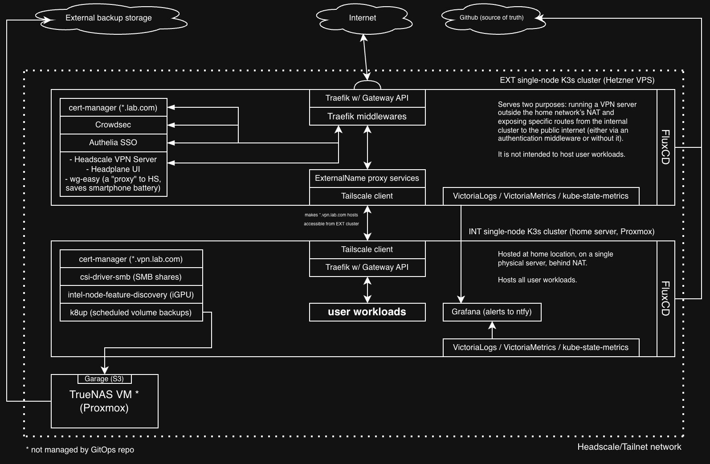

# HOMELAB-02



## About

**Hypervisor**: Proxmox VE <br />
**NAS**: TrueNAS VM (ZFS) <br />
**Number of clusters**: 2 <br />
**Number of nodes**: 1 (both clusters) <br />
**K8s distribution**: K3s (both clusters) <br />
**Deployments**: FluxCD <br />
**Mesh VPN / NAT traverse**: Headscale server + Headplane web UI + Tailscale clients <br />
**Volume backups**: k8up (uses Garage S3 as a storage for Restic repos running in a container on TrueNAS) <br />
**Observability**: VictoriaMetrics, VictoriaLogs, Alloy, kube-state-metrics, Grafana <br />
**Alerts**: ntfy

This GitOps project is an attempt to switch to an orchestrated and (as much as possible) declarative environment from a bunch of docker-compose files scattered across different VMs.
Given the fact that sky is the limit when it comes to over-engineering that involves Kubernetes, I've decided to limit my expectations to a non-HA setup.
I have only one physical server with good performance, so there were not that many options anyway. The only thing that needs to be rented is an external VPS to host the external cluster with VPN server on it, as I am behind NAT. 

OpenTofu is used for creating resources. Empty resources are then configured from scratch by Ansible playbooks.

The resulting infrastructure is pretty easy to use on a daily basis, it can be destroyed and created just in a few minutes. Feel free to take any part of it or use it as a whole.

## Installation

In Mac OS, most of these tools can be installed via homebrew.

If you want to automatically push a sanitized version of the repo to a separate repo with no history, enable pre-push hook: 

```
git config core.hooksPath .githooks
```

Sanitized version replaces all sops-encrypted secrets and other sensitive values that you specify in `sanitized-values.txt` in "test.com|abc.com" format.
Update the hook script to replace more files or paths, if needed.

### Required CLI tools

kubectl, opentofu, ansible, fluxcd, kustomize, age, sops

### Optional CLI tools

k9s (great for managing on-prem clusters), restic (for maintenance of backup snapshots)

## Deploying from scratch

### Prerequisite

#### DNS

```
You should have two A records:
- vpn.lab.com -> 100.64.0.11
- *.vpn.lab.com -> 100.64.0.11
```

This IP is a virtual one from Tailnet network and will be assigned to the internal cluster's peer later. You are free to set any other.
It's just much quicker to set IP from existing A records in Tailnet than the other way around, as there is no need to wait for DNS propagation.

#### cloud-init

OpenTofu's Proxmox provider requires a VM template to exist in Proxmox to create a local node. There is a very simple script that creates a VM template from Debian 13 cloud-init image. Tested it with VE 9.

### Steps

#### OpenTofu

1. Create opentofu/terraform.tfvars and opentofu/persistent/terraform.tfvars from corresponding examples.
2. Run 'tofu apply'. Once everything's done, OpenTofu will create an Ansible inventory called 'inventory.tf.yml' in ansible/ folder

#### Ansible

Run playbooks using 'inventory.tf.yml' inventory in this order:

1. system-utils-install.yml
2. k3s-internal-cluster-install.yml
3. k3s-external-cluster-install.yml
4. crowdsec-add-bouncer.yml (takes care of everything related to Crowdsec)

Once this is taken care of, open Authelia SSO (auth.lab.com). Log in with default credentials from the secret.
Authelia will require from you to have TOTP configured. A secret code to confirm TOTP will be created in the authelia's container: /config/notification.txt

Back to playbooks:

5. headscale-setup.yml

Both clusters will register in Headscale/Tailnet automatically afterwards, their nodes will get predictable static IPs. 
The last playbook will also connect Headplane UI to Headscale and register wg-easy server as a separate node.

Now, restore Forgejo backup with Ansible playbook: 

6. k8up-int-restore-app.yml -e 'namespace=forgejo'

Forgejo is particularly important because it contains docker images of certain workloads that don't exist in public registries (e.g. slskd-ntfy, astl).

That's it. Now you have both clusters in the same Tailnet network with FluxCD taking care of reconciliation/deployment.

#### Restore backups

After the initial FluxCD reconciliation, you are free to restore each namespace's state with a playbook:

```
ansible-playbook -i inventory.tf.yml k8up-int-restore-app.yml -e 'namespace=<ns>'
```

## Manual backup

If a backup of a certain namespace needs to be created, without waiting for the schedule, there's an Ansible playbook:

```
ansible-playbook -i inventory.tf.yml k8up-int-backup-app.yml -e 'namespace=<ns>'
```

## A note on TLS certificates

Previously, I was using a custom layer in Flux called "cert-secrets" to re-use certificates that were stored in this repo on the initial deployment of the cluster. This way I could prevent unneccessary new certificate 
requests when destroying and creating clusters many times (for testing OpenTofu/Ansible logic) and avoid hitting API limits set by Let's Encrypt. Unfortunately, this solution didn't work well with certificate renewal, 
because Flux, being the only source of truth, was overwriting the newly issued certificate with an expiring one from repository. As of now, there is no solution for this problem, and I am not sure I really need to 
re-create clusters that often since the active development of this project has been finished anyway.

## A note on Helm

This repository follows the *Rendered Manifests Pattern*, i.e. all Helm charts are rendered once and kept statically as read-only manifests inside 'flux/apps/base' or 'flux/infrastructure/base'.
In a home environment, it helps me rely less on external sources. If something needs to be modified, Kustomize patches are the solution.
Some applications (esp. user workloads) are defined manually as manifests under 'ext/' or 'int/' and have no 'base/'.

To update a Helm chart, the only thing needed is to run Renderer.sh with a newer version specified:

```
./renderer.sh --chart authelia --repo https://charts.authelia.com --version 0.11.6 --repo-name authelia --folder authelia --namespace authelia --is-infrastructure false
```

--is-infrastructure parameter determines in which Flux overlay (apps or infrastructure) the chart is going to be saved to.
To make the update process easier, Renderer.sh creates a comment with timestamp and all input arguments provided when it was executed for the last time.
If there is no such a comment in 'manifest.readonly.yaml', the manifest was created manually from some source, without Helm. In such exceptional cases, I leave a note.

If rendering chart for the first time, create a folder (that you'll specify later with '--folder' parameter). To override default Helm values, create 'values-base.yaml' on the root level of the folder.

## A note on Headscale

I've switched from Netbird for the sake of better cli tooling which allows an automatic configuring of a freshly installed infra with just one Ansible playbook. (headscale-setup.yaml)
With Netbird, I had to manually create an API token in the web interface and then pass it into Ansible playbook. 
Headscale also supports separate ACLs for any source address behind subnet router. Netbird, at the moment of writing this, supports ACLs only for destination IPs behind a router node.
Netbird was also causing a huge battery drain on my Android device while doing nothing. Neither "Lazy Connections" nor "Force relay on" did help.

Tailscale Android client appears to be better in terms of power consumption, but I couldn't explain myself why would I want to spend battery on 
direct peer connections from mobile network to k3s-int cluster, if I have k3s-ext VPS as a proxy with static IP anyway. 
That's why I've installed wg-easy on k3s-ext running as a subnet router for various mobile devices. 
NAT/Masquerading is disabled for the wg-easy router, so devices connected to it are easily identifiable by ACLs in Tailnet, as they preserve their address.

When configuring OpenWRT router to be an accessible node of tailnet with exposed LuCI. 
Don't forget to create an unmanaged interface for tailscale0 in LuCI, create a firewall zone for tailscale0 source with 'input' and 'output' set to 'accept'.
There is a chance that tailscale0 will not get ipv4 address by default (can be checked with `ip addr show dev tailscale0`), so you have to run `service tailscale restart` afterwards.

## Shared resources

Some resources (e.g. secrets) are not accessible from other namespaces, and using the "default" namespace without a reason is a bad practice.
But there are deployments (e.g. stub-website on ext) that use git-sync init containers to populate their volumes with static data like configuration, webpages, etc.
To avoid duplication of same resources in each namespace where they're needed, there exists a 'flux/shared-resources/' directory.
Each shared resource has its separate directory and can be included in Kustomization.yaml of any app/infrastructure where it is needed.
A copy will be created in the clusterfor each namespace on the reconciliation step.

## Cons/TODOs

- All deployments from namespaces that have a scheduled backup resource will be automatically scaled down for ~5 minutes every night. FluxCD's reconciliation is also suspended during this period. It's absolutely not an issue for a private home server though. 
- Unfortunately, using FluxCD's envsubst to remove repeating domain names from the repo has too many side-effects, primarily because of shell scripts in configmaps that are used in the dependencies.
- Maybe it's a good idea (for readability) to start using VictoriaMetrics Operator on both clusters instead of configuring VictoriaMetrics via ConfigMaps 