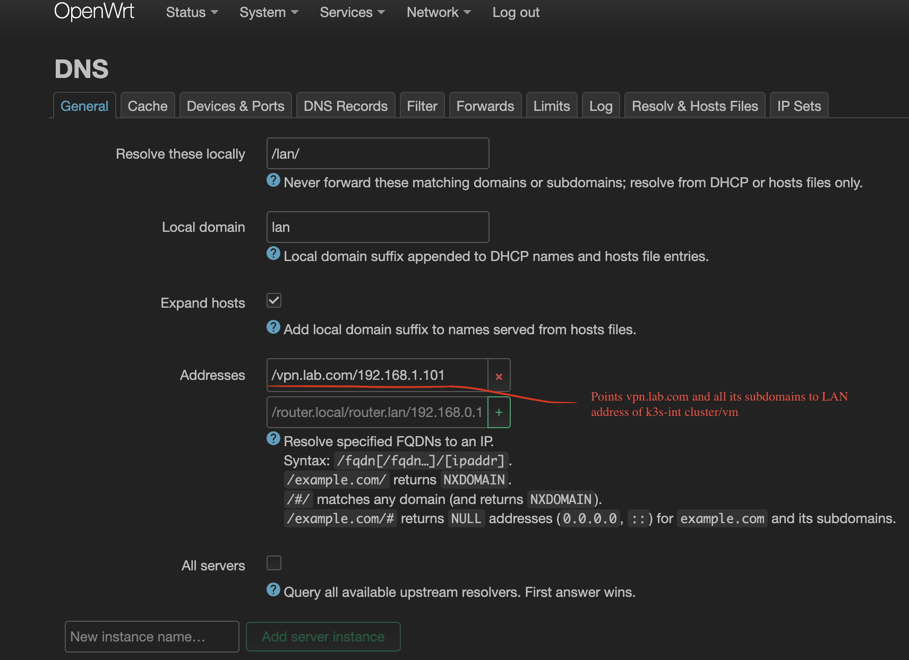

# Configuring internet-free fallback local access to k3s-int services

Some clients (like TV) cannot access Tailnet network easily. Others need to remain accessible even if there is no connection to the internet.
This is why we also want to resolve certain hosts on the local network level.

In LuCI, go to DNS page, stay on General tab. Add a following line to "Addresses" multi-field: `/vpn.lab.com/192.168.1.101`, 
where 192.168.1.101 is a local IP of k3s-int cluster. This is a wildcard expression, so any subdomain under vpn.lab.com will be properly resolved.

**NB!** k3s-int always requires truenas.lan to be reachable. Ensure that an A record exists in the router. 